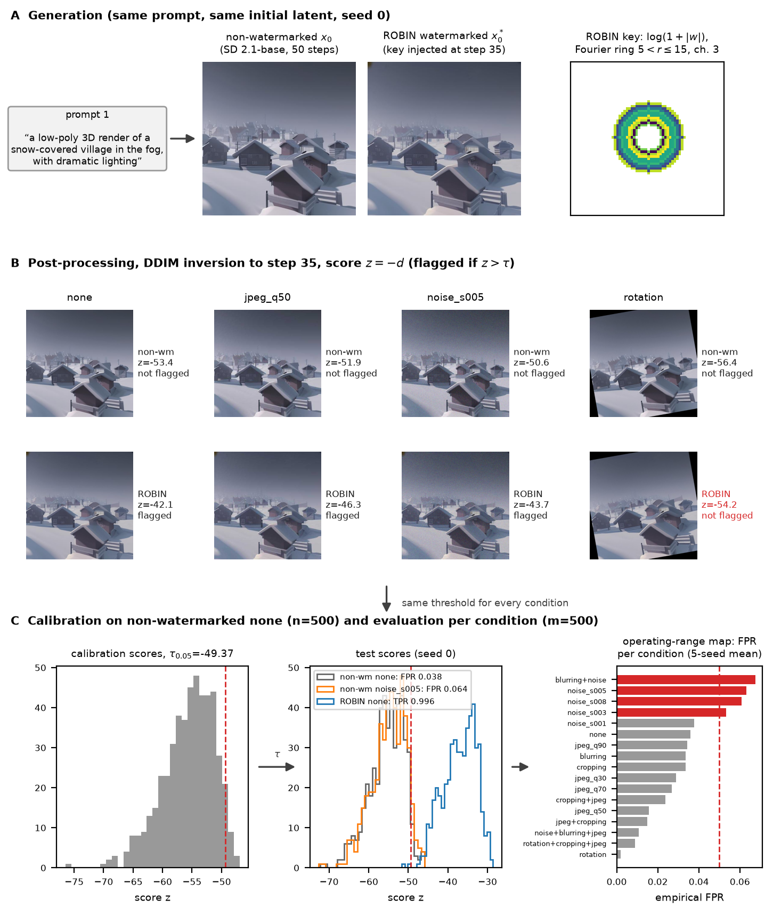
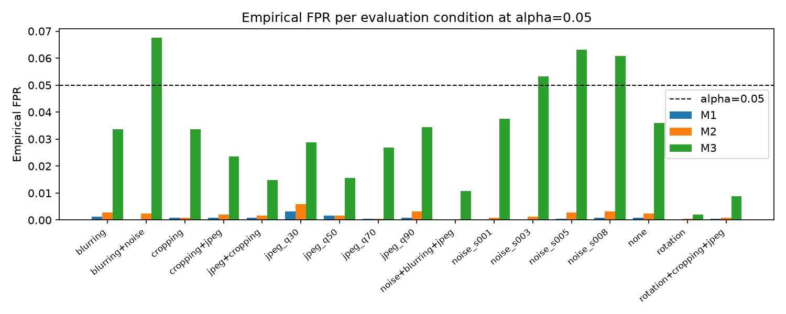
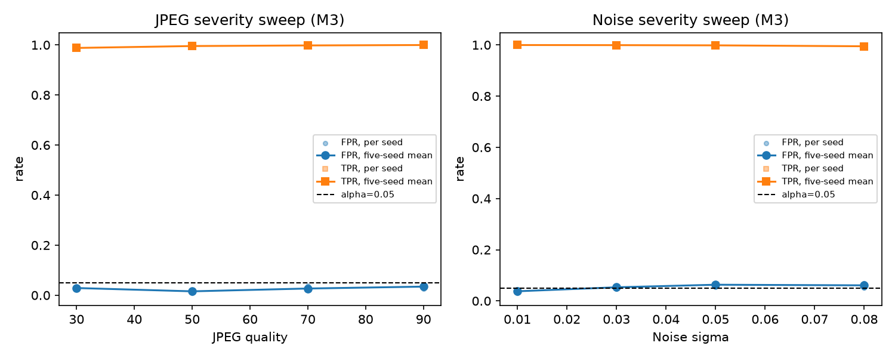
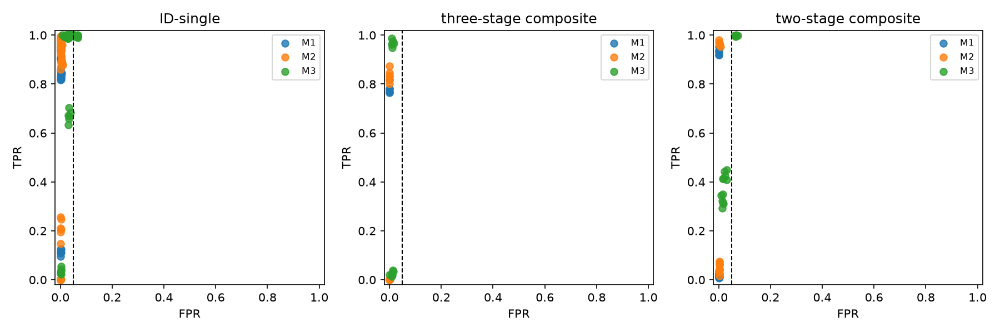
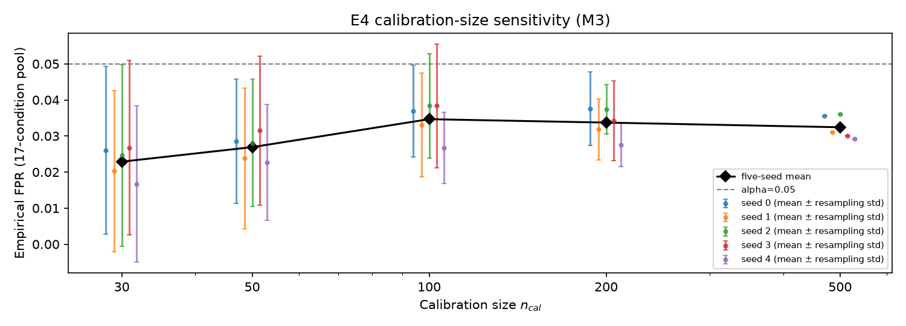
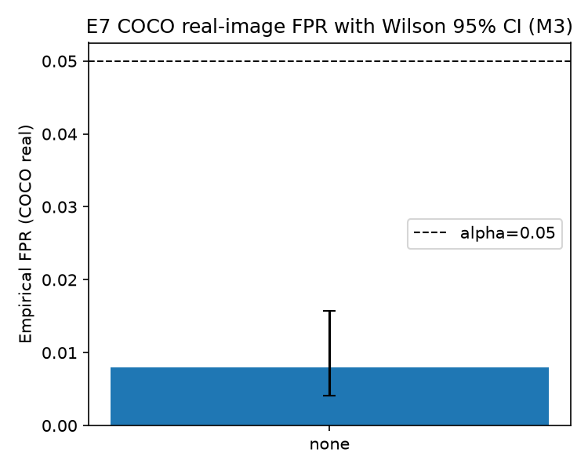
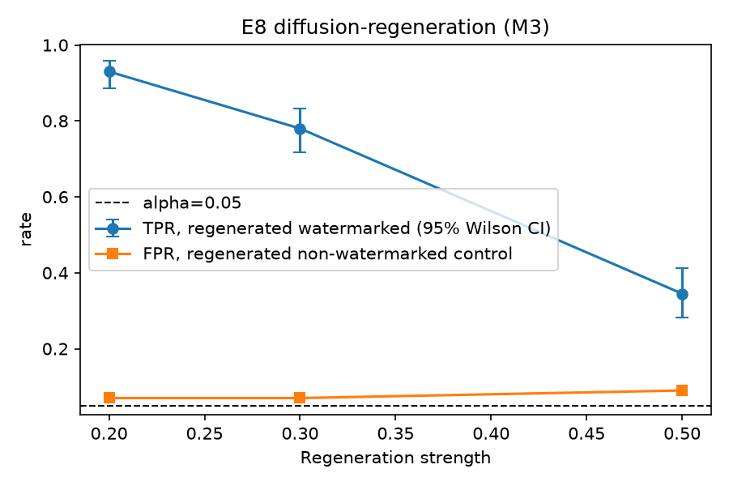
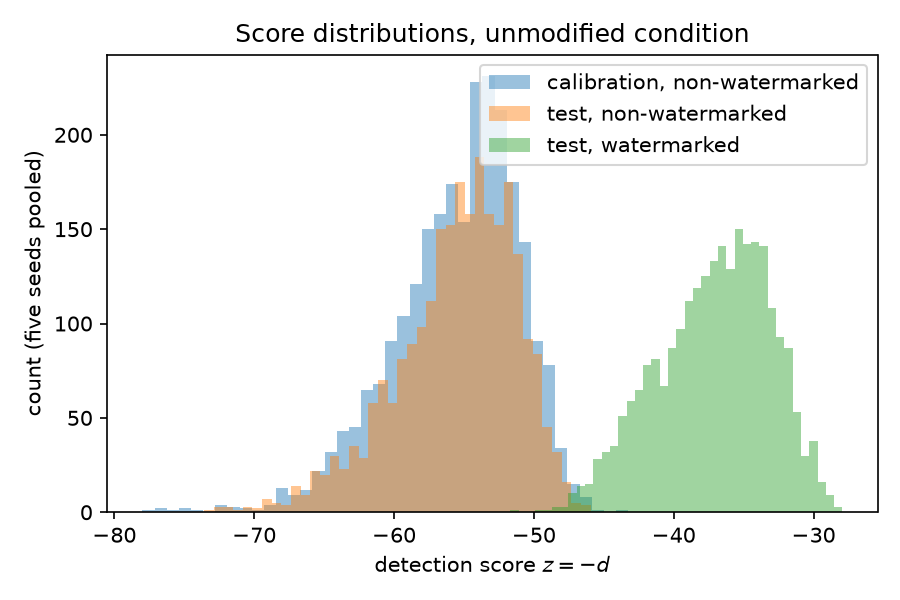

# FFSVCA — Fixed-FPR Security Verification of Inversion-Based Diffusion Watermark Detectors

We provide the code, evaluation manifest, result tables and figures for the paper

> **A Fixed-FPR Security Verification Protocol and Operating-Range Map for Inversion-Based Diffusion Watermark Detectors under Composite Post-Processing Attacks**

We do **not** propose a new watermark, detector or attack. We re-define the decision threshold of the
released ROBIN detector ([ROBIN, NeurIPS 2024](https://arxiv.org/abs/2411.03862)) as a split-conformal
quantile of non-watermarked calibration scores, hold that threshold fixed, and audit the empirical
false-positive rate (FPR) and true-positive rate (TPR) over 17 evaluation conditions, five generation seeds,
MS-COCO photographs, a diffusion-regeneration stress test and two comparator detectors (DWT-DCT-SVD and
Tree-Ring). Our product is an **operating-range map**: where the empirical FPR stayed within the budget α,
where it did not, and where detection sensitivity was lost. We report it as an empirical map over the
evaluated conditions, not as a general robustness claim.



*Figure 1 — We trace one test prompt (prompt 1, generation seed 0) through the protocol: (A) the paired
non-watermarked / ROBIN images and the Fourier key, (B) four of the 17 conditions with the stored score z and
our decision at τ₀.₀₅, (C) the calibration histogram, the seed-0 test distributions and the five-seed mean FPR
per condition.*

---

## 1. Protocol

We score an image as `z(x) = −d(x)`, where `d(x)` is ROBIN's inversion distance (mean |F − w| over the ring
mask, channel 3, 5 < r ≤ 15, of the latent we recover at the injection step 35 of 50).

| Rule | Definition (data we use) | α-dependent |
|---|---|---|
| M1 – Midpoint baseline | τ = ½(mean non-wm + mean wm calibration score) on `none` | no |
| M2 – ROC-selected | threshold maximizing Youden's J on the calibration pool of `none` | no |
| **M3 – Split-conformal** | τ_α = z₍ₖ₎, k = ⌈(n+1)(1−α)⌉, non-watermarked calibration scores under `none` only; decision `1[z > τ_α]` | yes |

We compute every threshold on the calibration split only (500 of 1,000 prompts, `split_seed=42`, shared by
all seeds) and separately for each generation seed. Under exchangeability, M3 gives the marginal guarantee
P[Z_new > τ_α] ≤ α for unmodified non-watermarked images; it gives **no** guarantee under post-processing,
which is exactly what we audit. We use α = 0.05 as the primary budget and 0.01 and 0.10 as secondary budgets.

## 2. Evaluation manifest (17 conditions)

| Group | attack_id | Stages |
|---|---|---|
| ID-single | `none` | unmodified control |
| ID-single | `jpeg_q{30,50,70,90}` | JPEG at quality q |
| ID-single | `rotation` | rotate 10° |
| ID-single | `cropping` | random resized crop, scale and aspect ratio 0.80 |
| ID-single | `blurring` | Gaussian blur, σ = 1.0 |
| ID-single | `noise_s{001,003,005,008}` | additive Gaussian noise, σ ∈ {.01,.03,.05,.08} |
| two-stage | `jpeg+cropping` | jpeg(50) → crop |
| two-stage | `cropping+jpeg` | crop → jpeg(50) |
| two-stage | `blurring+noise` | blur → noise(.03) |
| three-stage | `rotation+cropping+jpeg` | rotate → crop → jpeg(50) |
| three-stage | `noise+blurring+jpeg` | noise(.03) → blur → jpeg(50) |

We keep the machine-readable manifest in
[`outputs_p3/manifests/attack_manifest.json`](outputs_p3/manifests/attack_manifest.json).

## 3. Setup

| Item | What we used |
|---|---|
| Backbone | Stable Diffusion 2.1-base (`sd2-community/stable-diffusion-2-1-base`, fp16), DPM-Solver++ multistep, guidance 7.5, 50 steps |
| Watermark | ROBIN released checkpoint `optimized_r5_15_step10.pt` (channel 3, ring, w_low 5, w_up 15), injection at step 35 |
| Prompts | 1,000 synthetic template prompts ([`outputs_p3/prompts/prompt_list.csv`](outputs_p3/prompts/prompt_list.csv)), split 500/500 |
| Seeds | generation seeds {0,1,2,3,4} for E1, E2, E4, E5; seed 0 for E7–E10 |
| Test pool | 500 non-watermarked + 500 watermarked images per condition per seed |
| Compute | NVIDIA RTX 4090 (24 GB), CUDA 12.1, torch 2.3.1, batch size 34 |

```bash
pip install -r requirements.txt --extra-index-url https://download.pytorch.org/whl/cu121
```

We need the ROBIN code (`robin_official/`, with `optim_utils.py` and `inverse_stable_diffusion.py`) and its
released checkpoint, which we do not redistribute; our scripts expect `robin_official/` next to this
repository. On RunPod we install the pinned stack with `scripts_p3/runpod_setup.sh`.

## 4. Images: how we generated them and what we used

We do not upload the image sets; we regenerate them with the scripts below.

| Image set | How we generated it | What we used |
|---|---|---|
| Non-watermarked + ROBIN watermarked pairs (5 seeds × 1,000 prompts = 10,000 images) | `gen_pairs_cuda.py`: for prompt i and generation seed s we set the random seed to i + s and draw one initial latent; from that latent we generate the non-watermarked image and the ROBIN image, into which ROBIN writes its Fourier ring key at step 35 of 50 | SD 2.1-base (fp16), DPM-Solver++, guidance 7.5, 50 steps, ROBIN `optimized_r5_15_step10.pt`, the 1,000 prompts of `prompt_list.csv`, RTX 4090 |
| Tree-Ring watermarked images (seed 0, 1,000 images) | `gen_treering_cuda.py`: we reuse the same pipeline, prompts and per-image initial latents as the seed-0 non-watermarked images and write the Tree-Ring key into the initial latent x_T | Tree-Ring configuration of the official command (channel 3, ring, radius 10, key seed 999999, complex injection) |
| Attacked images (17 conditions) | `03_score_attacks_cuda.py` applies every condition of the manifest on the fly with a per-image seed, so that both images of a pair receive the same crop and noise draw | `attack_manifest.json` |
| MS-COCO photographs (E7) | we use 1,000 images of COCO val2017, the first 1,000 after a shuffle with seed 0 (`score_coco_real.py`) | MS-COCO val2017 (not redistributed) |
| img2img regenerations (E8) | `score_adaptive_regen.py`: we regenerate 200 watermarked and 200 non-watermarked images with SD 2.1-base img2img at strengths 0.2, 0.3, 0.5 | SD 2.1-base img2img |
| DWT-DCT-SVD images (E9) | `score_dwtdctsvd.py`: we embed a 64-bit key post hoc into the seed-0 non-watermarked images | `invisible-watermark` library, `dwtDctSvd` method |

## 5. Repository layout and pipeline

```
scripts_p3/                 our experiment scripts (run from the repository root)
outputs_p3/manifests/       17-condition attack manifest
outputs_p3/prompts/         prompt list
outputs_p3/metrics/         per-experiment metric CSV/TXT (E1–E8, re-split and reviewer analyses)
outputs_p3/tables/          paper tables as CSV
outputs_p3/treering/metrics Tree-Ring comparator (E10)
outputs_p3_appd/            DWT-DCT-SVD comparator (E9)
outputs_p3/figures/         paper figures (PDF + PNG)
```

| Step | Script(s) | Output |
|---|---|---|
| Prompts / manifest | `01_build_prompt_list.py`, `02_build_attack_manifest.py` | prompt list, manifest |
| Paired generation (CUDA) | `gen_pairs_cuda.py` | non-watermarked + ROBIN images per seed |
| Scoring (CUDA) | `03_score_attacks_cuda.py` (+ `_attack_scoring_common.py`), `04_parse_score_dump.py` | `scores_raw.csv` (170,000 items) |
| Split / thresholds | `05_make_splits.py`, `06_compute_thresholds.py` | calibration/test split, M1–M3 thresholds |
| E1 threshold comparison | `07_eval_e1_threshold_comparison.py` | `metrics/e1_*.csv` |
| E2/E6 FPR/TPR drift, severity | `08_eval_e2_fpr_drift.py` | `metrics/e2_fpr_drift.csv` |
| E4 calibration size | `10_eval_e4_calibration_size.py` | `metrics/e4_calibration_size.csv` |
| E5 failure conditions | `11_eval_failure_conditions.py` | `metrics/e5_failure_conditions.csv` |
| E7 MS-COCO real images | `score_coco_real.py`, `08c_eval_coco_real_fpr.py` | `metrics/e7_coco_real_fpr.csv` |
| E8 img2img regeneration | `score_adaptive_regen.py`, `08d_eval_adaptive_regen.py` | `metrics/e8_adaptive_regen.csv` |
| E9 DWT-DCT-SVD | `score_dwtdctsvd.py`, `08e_eval_dwtdctsvd_comparator.py` | `outputs_p3_appd/` |
| E10 Tree-Ring | `gen_treering_cuda.py`, `score_treering_cuda.py`, `run_treering_b2.sh`, `22_…`, `23_treering_fpr.py`, `24_treering_table.py` | `treering/metrics/` |
| Bootstrap CIs | `12_compute_ci.py` | `metrics/ci_bootstrap.csv` |
| Re-split / reviewer analyses | `19_s1_split_check.py`, `20_s1_e2_resplit.py`, `21_reviewer_local_bundle.py` | `metrics/s1_*`, `metrics/reviewer_local_bundle*` |
| Tables / figures / checks | `15_make_paper_tables.py`, `16_make_paper_figures.py`, `25_make_flow_figure.py`, `17_run_quality_checks.py` | `tables/`, `figures/` |

We do not include the image sets (Section 4), the raw score dumps (`scores_raw.csv`) or `final_summary.csv`
(74 MB); we regenerate them from the prompts, manifest, seeds and scripts. We do not use the experiment
identifier E3.

## 6. Results (α = 0.05 unless stated)

### E1 — Threshold rules on `none` (mean ± across-seed std, 5 seeds)

| Method | α | FPR | TPR |
|---|---|---|---|
| M1 | any | 0.0008 ± 0.0011 | 0.9844 ± 0.0038 |
| M2 | any | 0.0024 ± 0.0036 | 0.9912 ± 0.0018 |
| M3 | 0.01 | 0.0060 ± 0.0065 | 0.9968 ± 0.0023 |
| M3 | 0.05 | 0.0360 ± 0.0049 | 0.9992 ± 0.0018 |
| M3 | 0.10 | 0.0876 ± 0.0151 | 0.9996 ± 0.0009 |

We measured a seed-averaged AUC of 0.9998 on `none`. Over 2,000 re-drawn prompt partitions the five-seed mean
FPR averaged 0.00996 / 0.0498 / 0.0998, matching the split-conformal value 1 − k/(n+1).

### E2/E6 — M3 by condition (mean over 5 seeds; `exc.` = seeds with FPR > α)

| Group | attack_id | FPR | TPR | exc. |
|---|---|---|---|---|
| ID-single | none (control) | 0.0360 | 0.999 | 0 |
| ID-single | jpeg_q30 | 0.0288 | 0.988 | 0 |
| ID-single | jpeg_q50 | 0.0156 | 0.996 | 0 |
| ID-single | jpeg_q70 | 0.0268 | 0.998 | 0 |
| ID-single | jpeg_q90 | 0.0344 | 1.000 | 0 |
| ID-single | rotation | 0.0020 | 0.036 | 0 |
| ID-single | cropping | 0.0336 | 0.670 | 0 |
| ID-single | blurring | 0.0336 | 0.999 | 0 |
| ID-single | noise_s001 | 0.0376 | 1.000 | 0 |
| ID-single | noise_s003 | 0.0532 | 0.999 | 3 |
| ID-single | noise_s005 | 0.0632 | 0.998 | 5 |
| ID-single | noise_s008 | 0.0608 | 0.995 | 5 |
| two-stage | jpeg+cropping | 0.0148 | 0.323 | 0 |
| two-stage | cropping+jpeg | 0.0236 | 0.425 | 0 |
| two-stage | blurring+noise | 0.0676 | 0.998 | 5 |
| three-stage | rotation+cropping+jpeg | 0.0088 | 0.025 | 0 |
| three-stage | noise+blurring+jpeg | 0.0108 | 0.968 | 0 |

- We found 67 of 85 condition–seed observations within budget; all 18 observed exceedances occurred under
  additive noise at σ ≥ 0.03 or `blurring+noise`. We treat them as point-estimate exceedances: 7 of the 18
  have an unadjusted one-sided exact binomial p ≤ 0.05 and none survives Holm/BH adjustment; pooled over seeds
  (approximate), the exceedance is Holm-significant for `blurring+noise` and `noise_s005`. Over 1,000
  re-drawn partitions the four noise-related exceedances recurred in 96.3–99.9 % of cases.
- We observed that rotation and cropping-containing processing reduced TPR while the observed FPR stayed low.



*Figure 2 — We plot the seed-averaged empirical FPR for M1, M2, M3 across the 17 conditions.*



*Figure 3 — We plot FPR and TPR versus JPEG quality and noise σ in the severity sweep (E6; faint markers:
per-seed values).*



*Figure 4 — We plot FPR against TPR by group (ID-single, three-stage, two-stage).*

### E4 — Calibration-size sensitivity

We measured a mean FPR on the pooled 17-condition test set of 2.29 %, 2.69 %, 3.47 %, 3.37 % and 3.24 % at
n_cal = 30, 50, 100, 200, 500 (100 resamples per size and seed).



*Figure 5 — We show the calibration-size sensitivity of M3 per seed (error bars: std across resamples).*

### E5 — Failure conditions

We counted V_s (conditions with FPR > α per seed) = 0 for M1/M2 and 3.6 ± 0.5 of 17 for M3 (4, 3, 4, 3, 4
for seeds 0–4).

### E7 — MS-COCO photographs (1,000 images, seed-0 thresholds)

| α | Empirical FPR (95 % Wilson CI) | abs. deviation from α |
|---|---|---|
| 0.01 | 0.003 (0.001–0.009) | 0.007 |
| 0.05 | 0.008 (0.004–0.016) | 0.042 |
| 0.10 | 0.029 (0.020–0.041) | 0.071 |



*Figure 6 — We show the empirical FPR of M3 on MS-COCO at α = 0.05 with its Wilson interval.*

### E8 — img2img regeneration stress test (200 images per cell, seed 0)

| Strength | TPR (95 % CI) | FPR (95 % CI) | FPR − α |
|---|---|---|---|
| 0.2 | 0.930 (0.886–0.958) | 0.070 (0.042–0.114) | +0.020 |
| 0.3 | 0.780 (0.718–0.832) | 0.070 (0.042–0.114) | +0.020 |
| 0.5 | 0.345 (0.283–0.413) | 0.090 (0.058–0.138) | +0.040 |



*Figure 7 — We plot TPR and FPR of M3 versus regeneration strength.*



*Figure 8 — We show the score distributions under `none`, pooled over five seeds.*

### E9 — DWT-DCT-SVD comparator (seed 0, own calibration pool)

We measured FPR / TPR of 0.030 / 1.000 under `none`, 0.038 / 0.736 under `jpeg_q50` and 0.042 / 0.004 under
`cropping`; the FPR stayed within the budget under all three conditions.

### E10 — Tree-Ring comparator (seed 0, same partition as ROBIN seed 0)

We measured a test-split AUC of 0.9991 and a TPR of 99.4 % on unmodified inputs. We list selected rows below
(full table: [`outputs_p3/treering/metrics/treering_fpr.csv`](outputs_p3/treering/metrics/treering_fpr.csv));
KS is the empirical two-sample KS distance to `none`, and P(exc.) is the fraction of 1,000 re-drawn
partitions with FPR > α.

| attack_id | Tree-Ring FPR (CI) | KS | P(exc.) | ROBIN FPR (CI) | KS | P(exc.) |
|---|---|---|---|---|---|---|
| none | 0.052 (0.036–0.075) | 0.000 | 0.42 | 0.038 (0.024–0.059) | 0.000 | 0.45 |
| noise_s003 | 0.030 (0.018–0.049) | 0.076 | 0.05 | 0.060 (0.042–0.084) | 0.038 | 0.81 |
| noise_s005 | 0.026 (0.015–0.044) | 0.090 | 0.00 | 0.064 (0.046–0.089) | 0.058 | 0.94 |
| noise_s008 | 0.022 (0.012–0.039) | 0.125 | 0.00 | 0.068 (0.049–0.094) | 0.082 | 0.96 |
| blurring+noise | 0.028 (0.017–0.046) | 0.127 | 0.02 | 0.066 (0.047–0.091) | 0.045 | 0.96 |
| rotation | 0.024 (0.014–0.041) | 0.139 | 0.00 | 0.002 (0.000–0.011) | 0.251 | 0.00 |

In this single-seed comparison we did not reproduce the noise-related exceedances of ROBIN with Tree-Ring.

## 7. Scope and limitations

We study a single primary detector (the released ROBIN checkpoint) on one backbone (SD 2.1-base); our five
generation seeds share one prompt partition; we evaluate the comparators with one seed (and three conditions
for DWT-DCT-SVD); we use synthetic English prompts, fixed composite severities and non-adaptive attacks only.
The split-conformal guarantee we rely on applies only to unmodified non-watermarked inputs.
